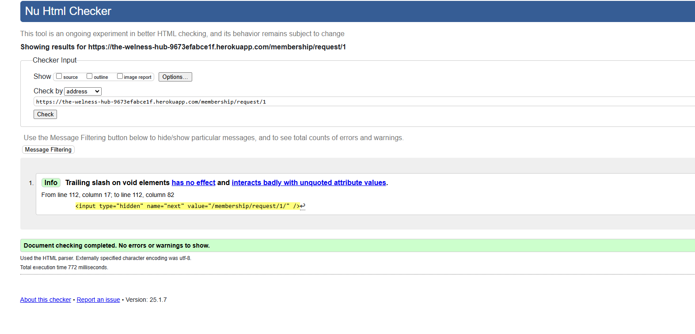

# Testing

> [!NOTE]
> Return back to the [README.md](README.md) file.

## Code Validation

### HTML

I have used the recommended [HTML W3C Validator](https://validator.w3.org) to validate all of my HTML files.

| Directory | File | URL | Screenshot | Notes |
| --- | --- | --- | --- | --- |
| contact | [contact.html](https://github.com/dfedyachkina/gym-site/blob/main/contact/templates/contact/contact.html) | https://the-welness-hub-9673efabce1f.herokuapp.com/contact/ |  | N/A |
| error | [404.html](https://github.com/dfedyachkina/gym-site/blob/main/error/templates/page404/404.html) | https://the-welness-hub-9673efabce1f.herokuapp.com/404/ |  | Notes (if applicable) |
| gym_home | [home.html](https://github.com/dfedyachkina/gym-site/blob/main/gym_home/templates/gym_home/home.html) | https://the-welness-hub-9673efabce1f.herokuapp.com/ |  | N/A |
| membership | [membership.html](https://github.com/dfedyachkina/gym-site/blob/main/membership/templates/membership/membership.html) | https://the-welness-hub-9673efabce1f.herokuapp.com/membership/  |  | N/A |
| membership | [membership_request.html](https://github.com/dfedyachkina/gym-site/blob/main/membership/templates/membership/membership_request.html) | N/A |  | Link is not applicable because the link contains id |
| membership | [membership_success.html](https://github.com/dfedyachkina/gym-site/blob/main/membership/templates/membership/membership_success.html) | https://the-welness-hub-9673efabce1f.herokuapp.com/membership/success/|  | N/A |
| personal_trainer | [appointment_list.html](https://github.com/dfedyachkina/gym-site/blob/main/personal_trainer/templates/personal_trainer/appointment_list.html) | https://the-welness-hub-9673efabce1f.herokuapp.com/appointments/appointment-list/ |  | N/A |
| personal_trainer | [create_appointment.html](https://github.com/dfedyachkina/gym-site/blob/main/personal_trainer/templates/personal_trainer/create_appointment.html) | https://the-welness-hub-9673efabce1f.herokuapp.com/appointments/create-appointment/ |  | N/A |
| personal_trainer | [update_appointment.html](https://github.com/dfedyachkina/gym-site/blob/main/personal_trainer/templates/personal_trainer/update_appointment.html) | N/A |  | Link is not applicable because the link contains id |

### CSS

I have used the recommended [CSS Jigsaw Validator](https://jigsaw.w3.org/css-validator) to validate all of my CSS files.

| Directory | File | URL | Screenshot | Notes |
| --- | --- | --- | --- | --- |
| static | [style.css](https://github.com/dfedyachkina/gym-site/blob/main/static/css/style.css) | N/A |  | All errors point to external libraries |

### JavaScript

I have used the recommended [JShint Validator](https://jshint.com) to validate all of my JS files.

| Directory | File | URL | Screenshot | Notes |
| --- | --- | --- | --- | --- |
| static | [script.js](https://github.com/dfedyachkina/gym-site/blob/main/static/js/script.js) | N/A |  | My script.js is empty, because I have used small scripts in templates  |

### Python

I have used the recommended [PEP8 CI Python Linter](https://pep8ci.herokuapp.com) to validate all of my Python files.

| Directory | File | URL | Screenshot | Notes |
| --- | --- | --- | --- | --- |
| accounts | [admin.py](https://github.com/dfedyachkina/gym-site/blob/main/accounts/admin.py) | [PEP8 CI Link](https://pep8ci.herokuapp.com/https://raw.githubusercontent.com/dfedyachkina/gym-site/main/accounts/admin.py) |  | N/A |
| accounts | [forms.py](https://github.com/dfedyachkina/gym-site/blob/main/accounts/forms.py) | [PEP8 CI Link](https://pep8ci.herokuapp.com/https://raw.githubusercontent.com/dfedyachkina/gym-site/main/accounts/forms.py) |  | N/A |
| accounts | [models.py](https://github.com/dfedyachkina/gym-site/blob/main/accounts/models.py) | [PEP8 CI Link](https://pep8ci.herokuapp.com/https://raw.githubusercontent.com/dfedyachkina/gym-site/main/accounts/models.py) |  | N/A |
| accounts | [tests.py](https://github.com/dfedyachkina/gym-site/blob/main/accounts/tests.py) | [PEP8 CI Link](https://pep8ci.herokuapp.com/https://raw.githubusercontent.com/dfedyachkina/gym-site/main/accounts/tests.py) |  | N/A |
| accounts | [views.py](https://github.com/dfedyachkina/gym-site/blob/main/accounts/views.py) | [PEP8 CI Link](https://pep8ci.herokuapp.com/https://raw.githubusercontent.com/dfedyachkina/gym-site/main/accounts/views.py) |  | N/A |
| contact | [admin.py](https://github.com/dfedyachkina/gym-site/blob/main/contact/admin.py) | [PEP8 CI Link](https://pep8ci.herokuapp.com/https://raw.githubusercontent.com/dfedyachkina/gym-site/main/contact/admin.py) |  | N/A |
| contact | [forms.py](https://github.com/dfedyachkina/gym-site/blob/main/contact/forms.py) | [PEP8 CI Link](https://pep8ci.herokuapp.com/https://raw.githubusercontent.com/dfedyachkina/gym-site/main/contact/forms.py) |  | N/A |
| contact | [models.py](https://github.com/dfedyachkina/gym-site/blob/main/contact/models.py) | [PEP8 CI Link](https://pep8ci.herokuapp.com/https://raw.githubusercontent.com/dfedyachkina/gym-site/main/contact/models.py) |  | N/A |
| contact | [tests.py](https://github.com/dfedyachkina/gym-site/blob/main/contact/tests.py) | [PEP8 CI Link](https://pep8ci.herokuapp.com/https://raw.githubusercontent.com/dfedyachkina/gym-site/main/contact/tests.py) |  | N/A |
| contact | [urls.py](https://github.com/dfedyachkina/gym-site/blob/main/contact/urls.py) | [PEP8 CI Link](https://pep8ci.herokuapp.com/https://raw.githubusercontent.com/dfedyachkina/gym-site/main/contact/urls.py) |  | N/A |
| contact | [views.py](https://github.com/dfedyachkina/gym-site/blob/main/contact/views.py) | [PEP8 CI Link](https://pep8ci.herokuapp.com/https://raw.githubusercontent.com/dfedyachkina/gym-site/main/contact/views.py) |  | N/A |
| error | [models.py](https://github.com/dfedyachkina/gym-site/blob/main/error/models.py) | [PEP8 CI Link](https://pep8ci.herokuapp.com/https://raw.githubusercontent.com/dfedyachkina/gym-site/main/error/models.py) |  | N/A |
| error | [tests.py](https://github.com/dfedyachkina/gym-site/blob/main/error/tests.py) | [PEP8 CI Link](https://pep8ci.herokuapp.com/https://raw.githubusercontent.com/dfedyachkina/gym-site/main/error/tests.py) |  | N/A |
| error | [urls.py](https://github.com/dfedyachkina/gym-site/blob/main/error/urls.py) | [PEP8 CI Link](https://pep8ci.herokuapp.com/https://raw.githubusercontent.com/dfedyachkina/gym-site/main/error/urls.py) |  | N/A |
| error | [views.py](https://github.com/dfedyachkina/gym-site/blob/main/error/views.py) | [PEP8 CI Link](https://pep8ci.herokuapp.com/https://raw.githubusercontent.com/dfedyachkina/gym-site/main/error/views.py) |  | N/A |
| gym_home | [admin.py](https://github.com/dfedyachkina/gym-site/blob/main/gym_home/admin.py) | [PEP8 CI Link](https://pep8ci.herokuapp.com/https://raw.githubusercontent.com/dfedyachkina/gym-site/main/gym_home/admin.py) |  | N/A |
| gym_home | [models.py](https://github.com/dfedyachkina/gym-site/blob/main/gym_home/models.py) | [PEP8 CI Link](https://pep8ci.herokuapp.com/https://raw.githubusercontent.com/dfedyachkina/gym-site/main/gym_home/models.py) |  | N/A |
| gym_home | [tests.py](https://github.com/dfedyachkina/gym-site/blob/main/gym_home/tests.py) | [PEP8 CI Link](https://pep8ci.herokuapp.com/https://raw.githubusercontent.com/dfedyachkina/gym-site/main/gym_home/tests.py) |  | N/A |
| gym_home | [urls.py](https://github.com/dfedyachkina/gym-site/blob/main/gym_home/urls.py) | [PEP8 CI Link](https://pep8ci.herokuapp.com/https://raw.githubusercontent.com/dfedyachkina/gym-site/main/gym_home/urls.py) |  | N/A |
| gym_home | [views.py](https://github.com/dfedyachkina/gym-site/blob/main/gym_home/views.py) | [PEP8 CI Link](https://pep8ci.herokuapp.com/https://raw.githubusercontent.com/dfedyachkina/gym-site/main/gym_home/views.py) |  | N/A |
|  | [manage.py](https://github.com/dfedyachkina/gym-site/blob/main/manage.py) | [PEP8 CI Link](https://pep8ci.herokuapp.com/https://raw.githubusercontent.com/dfedyachkina/gym-site/main/manage.py) |  | N/A |
| membership | [admin.py](https://github.com/dfedyachkina/gym-site/blob/main/membership/admin.py) | [PEP8 CI Link](https://pep8ci.herokuapp.com/https://raw.githubusercontent.com/dfedyachkina/gym-site/main/membership/admin.py) |  | N/A |
| membership | [models.py](https://github.com/dfedyachkina/gym-site/blob/main/membership/models.py) | [PEP8 CI Link](https://pep8ci.herokuapp.com/https://raw.githubusercontent.com/dfedyachkina/gym-site/main/membership/models.py) |  | N/A |
| membership | [tests.py](https://github.com/dfedyachkina/gym-site/blob/main/membership/tests.py) | [PEP8 CI Link](https://pep8ci.herokuapp.com/https://raw.githubusercontent.com/dfedyachkina/gym-site/main/membership/tests.py) |  | N/A |
| membership | [urls.py](https://github.com/dfedyachkina/gym-site/blob/main/membership/urls.py) | [PEP8 CI Link](https://pep8ci.herokuapp.com/https://raw.githubusercontent.com/dfedyachkina/gym-site/main/membership/urls.py) |  | N/A |
| membership | [views.py](https://github.com/dfedyachkina/gym-site/blob/main/membership/views.py) | [PEP8 CI Link](https://pep8ci.herokuapp.com/https://raw.githubusercontent.com/dfedyachkina/gym-site/main/membership/views.py) |  | N/A |
| personal_trainer | [admin.py](https://github.com/dfedyachkina/gym-site/blob/main/personal_trainer/admin.py) | [PEP8 CI Link](https://pep8ci.herokuapp.com/https://raw.githubusercontent.com/dfedyachkina/gym-site/main/personal_trainer/admin.py) |  | N/A |
| personal_trainer | [forms.py](https://github.com/dfedyachkina/gym-site/blob/main/personal_trainer/forms.py) | [PEP8 CI Link](https://pep8ci.herokuapp.com/https://raw.githubusercontent.com/dfedyachkina/gym-site/main/personal_trainer/forms.py) |  | N/A |
| personal_trainer | [models.py](https://github.com/dfedyachkina/gym-site/blob/main/personal_trainer/models.py) | [PEP8 CI Link](https://pep8ci.herokuapp.com/https://raw.githubusercontent.com/dfedyachkina/gym-site/main/personal_trainer/models.py) |  | N/A |
| personal_trainer | [tests.py](https://github.com/dfedyachkina/gym-site/blob/main/personal_trainer/tests.py) | [PEP8 CI Link](https://pep8ci.herokuapp.com/https://raw.githubusercontent.com/dfedyachkina/gym-site/main/personal_trainer/tests.py) |  | N/A |
| personal_trainer | [urls.py](https://github.com/dfedyachkina/gym-site/blob/main/personal_trainer/urls.py) | [PEP8 CI Link](https://pep8ci.herokuapp.com/https://raw.githubusercontent.com/dfedyachkina/gym-site/main/personal_trainer/urls.py) |  | N/A |
| personal_trainer | [views.py](https://github.com/dfedyachkina/gym-site/blob/main/personal_trainer/views.py) | [PEP8 CI Link](https://pep8ci.herokuapp.com/https://raw.githubusercontent.com/dfedyachkina/gym-site/main/personal_trainer/views.py) |  | N/A |
| the_welness_hub | [contexts.py](https://github.com/dfedyachkina/gym-site/blob/main/the_welness_hub/contexts.py) | [PEP8 CI Link](https://pep8ci.herokuapp.com/https://raw.githubusercontent.com/dfedyachkina/gym-site/main/the_welness_hub/contexts.py) |  | N/A |
| the_welness_hub | [settings.py](https://github.com/dfedyachkina/gym-site/blob/main/the_welness_hub/settings.py) | [PEP8 CI Link](https://pep8ci.herokuapp.com/https://raw.githubusercontent.com/dfedyachkina/gym-site/main/the_welness_hub/settings.py) |  | N/A |
| the_welness_hub | [urls.py](https://github.com/dfedyachkina/gym-site/blob/main/the_welness_hub/urls.py) | [PEP8 CI Link](https://pep8ci.herokuapp.com/https://raw.githubusercontent.com/dfedyachkina/gym-site/main/the_welness_hub/urls.py) |  | N/A |

